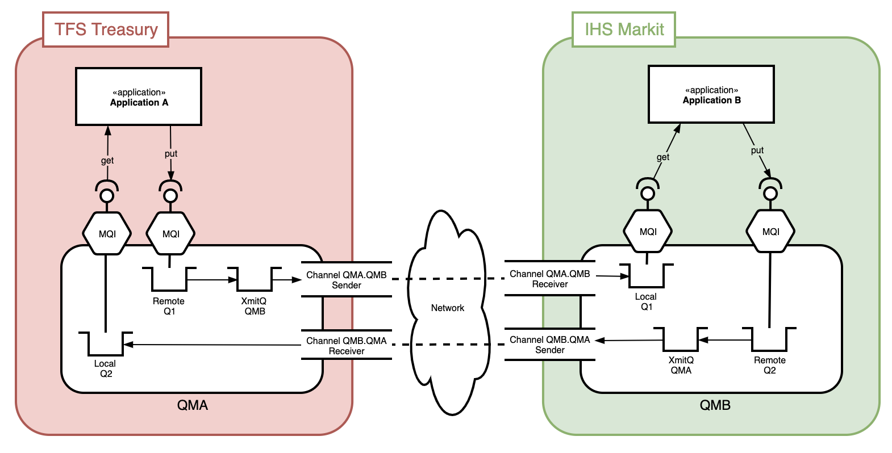
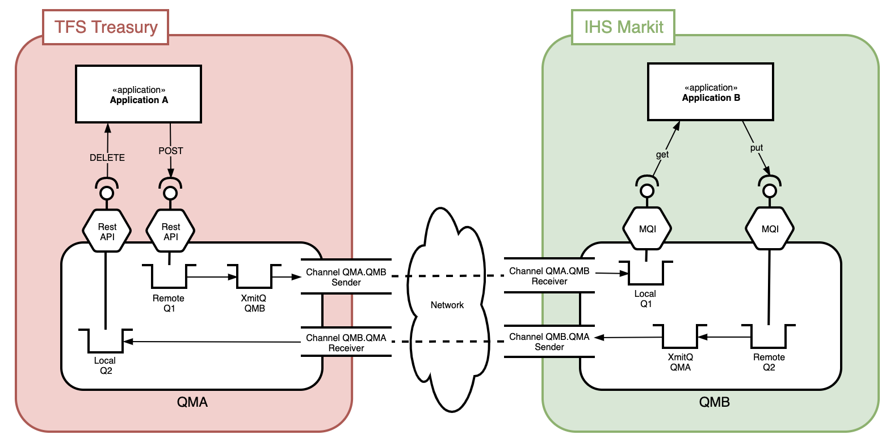
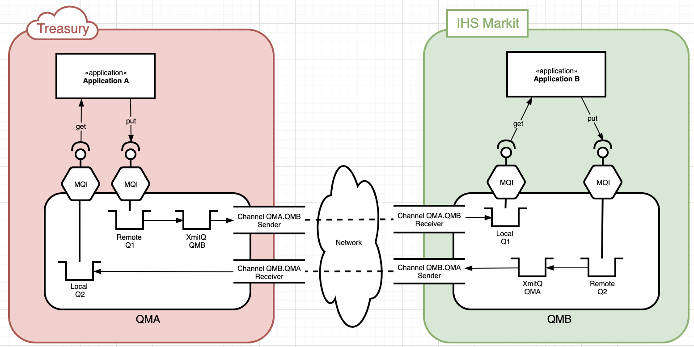
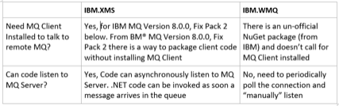
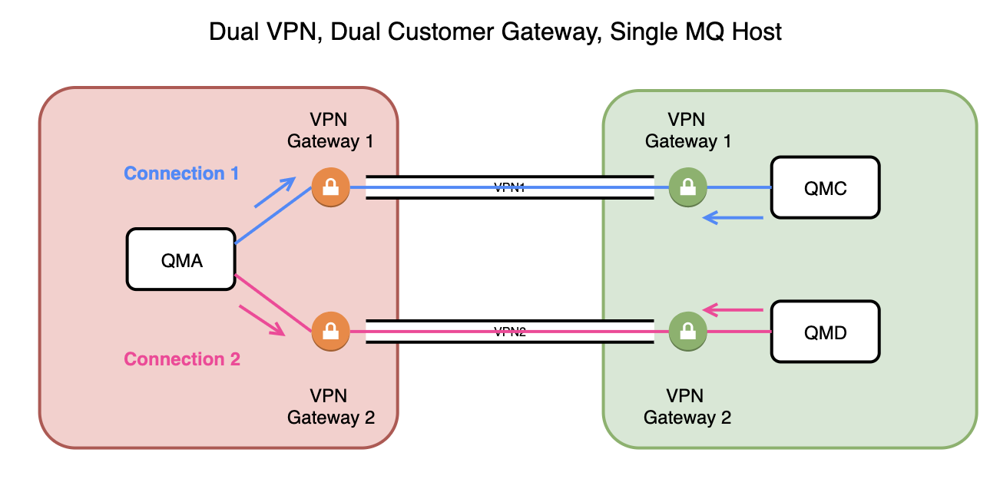
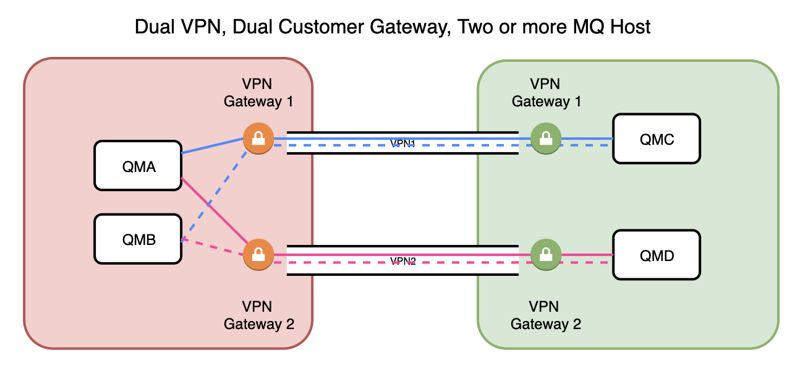
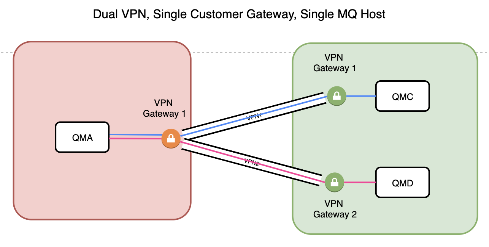
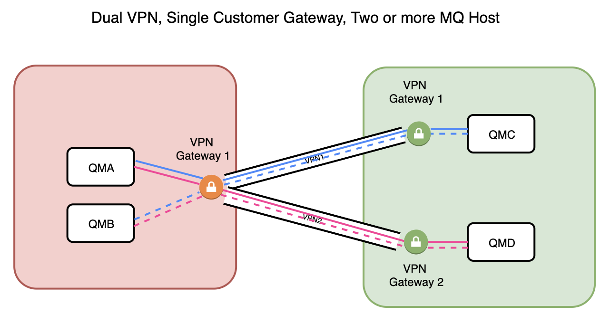
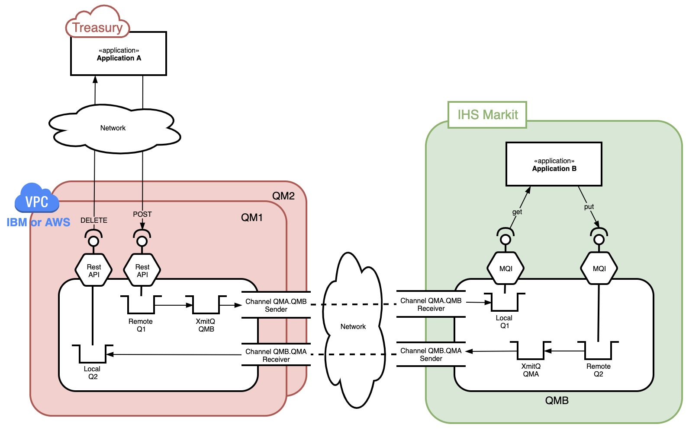

# Table of Contents

[<b>1 MQ Overview</b>](#1-mq-overview)

[<b>2 REST API and MQ</b>](#2-rest-api-mq)

&nbsp;&nbsp;&nbsp;&nbsp;[2.1 Sending a message](#21-sending-a-message)

&nbsp;&nbsp;&nbsp;&nbsp;[2.2 Receive a message](#22-receive-a-message)

[<b>3 IBM MQ as Cloud Hosted Service</b>](#3-ibm-mq-as-cloud-hosted-service)

[<b>4 VPN Connectivity</b>](#4-vpn-connectivity)

[<b>5 Recommendations</b>](#5-recommendations)

[<b>6 References</b>](#6-references)

<br/>

 
 
## 1 MQ Overview

Data is transferred between applications in messages. A message is a container that consists of three parts:

- WebSphere MQ Message Descriptor (MQMD): Identifies the message and contains additional control information. Examples of additional information are the type of message and the priority that is assigned to the message by the sending application.
- Message properties: An optional set of user-definable elements that describes the message without being part of the payload. Applications that receive messages can choose whether to inspect these properties.
- Message data: Contains the application data. The structure of the data is defined by the application programs that use it, and WebSphere MQ is largely unconcerned with its format or content.

The nodes, within a WebSphere MQ message queuing infrastructure, are called queue managers. The queue manager is responsible for accepting and delivering messages. Multiple queue managers can run on a single physical server or on a wide network of servers across a large variety of different hardware and operating system platforms.

Typical MQ deployment topology is shown in Figure 1,




Figure 1: TFS Treasury to IHS Markit Deployment Topology

## 2 REST API and MQ

An IBM Queue Manager has 2 REST APIs available to call:
- Administration REST API – to support administrative actions against the queue manager
- Messaging REST API - that allows applications to send and receive messages

Comments related to Messaging REST API:
- Supported on all platforms and in the cloud,
- Enable interact with existing applications, using existing MQ APIs, from anywhere,
- Originally added in 9.0.4 Continuous Delivery, and now available in 9.1.0 Long Term Support,
- Currently provides support for sending and receiving text-based messages to queues.



Figure 2: REST API for MQ

### 2.1 Sending a message
- Send a message to a target queue / queue manager using the `HTTP POST` verb.
- Message must have a text-based Content-Type HTTP header. Results in a message with a MQMD.Format of `MQSTR`.
- Certain `MQMD` properties exposed as HTTP headers.
- Authentication performed using caller’s user ID.
- Caller must be a member of the MQWebUser role.

```
POST …/qmgr/QM1/queue/Q1/message 
-H “Content-Type:application/xml”
-H “ibm-mq-md-correlationId: 414d5346ef…”
-H “ibm-mq-md-expiry: 60000”
-H “ibm-mq-md-persistence: persistent”
-D “<payload>data</payload>”
```
### 2.2 Receive a message
- Get a message from a target queue / queue manager using the `HTTP DELETE` verb,
- Only works if message on queue has a `MQMD`.Format of `MQSTR`. Otherwise message will remain on queue and an error is returned,
- Query parameters can be used to select by correlation and / or message id, as well as specifying a wait interval,
- Message body is returned as `HTTP` response body,
- Certain MQMD fields returned as `HTTP` headers on response.

```
DELETE …/qmgr/QM1/queue/Q1/message
?correlationId=414d5346ef…
&wait=60000
```

## 3 IBM MQ as Cloud Hosted Service



Figure 3: IBM MQ as Cloud HOsted Service

- Available on IBM Cloud and AWS as IBM MQ Hosted Service
- Not available on Azure

There are two ways to access IBM MQ from .NET code
- Using `IBM.XMS` libraries – IBM Message Service API for `.NET`
- Using `IBM.WMQ` libraries 



## 4 VPN Connectivity

### 4.1 Option 1


 
### 4.2 Option 2



### 4.3 Option 3




### 4.4 Option 4




## 5 Recommendations

- Use IBM MQ deployedd on cloud (IBM or AWS),
- Use MQ REST API to communicate with MQ Objects.



Use Option 2 for connection to IHS Markit.


## 6 References

[1]	IBM MQ: http://www.redbooks.ibm.com/redpapers/pdfs/redp0021.pdf  
[2]	IBM MQ on Cloud: https://cloud.ibm.com/docs/mqcloud?topic=mqcloud-mqoc_new_to_mq
[3]	Architecting Messaging Solutions in AWS Cloud using IBM® MQ: https://developer.ibm.com/recipes/tutorials/architecting-messaging-solutions-in-aws-cloud-using-ibm-mq/ 
[4]	Access IBM WebSphere MQ from Azure Service Fabric: https://medium.com/@binduc/access-ibm-websphere-mq-from-azure-service-fabric-310315f16e44 
[5]	Connect to an IBM MQ server from Azure Logic Apps: https://docs.microsoft.com/en-us/azure/connectors/connectors-create-api-mq

